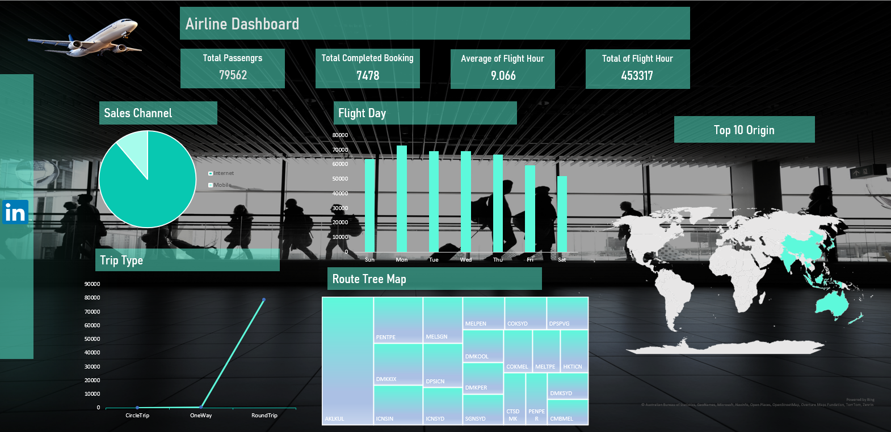

# ✈️ Airline Dashboard  

## 📌 Overview  
This repository contains an **Airline Dashboard** designed in **Microsoft Excel**.  
The dashboard visualizes and analyzes important airline performance metrics, enabling better decision-making and providing clear insights.  

---

## 📊 Key Metrics  
- 👥 **Total Passengers:** 79,562  
- 📑 **Completed Bookings:** 7,478  
- ⏱️ **Average Flight Hours:** 9.06  
- 🌍 **Total Flight Hours:** 453,317  

---

## 🔎 Dashboard Features  
- **Sales Channel Analysis**: Internet vs Mobile.  
- **Flight Day Distribution**: Passenger traffic across weekdays.  
- **Trip Types**: One Way, Round Trip, Circle Trip.  
- **Route Tree Map**: Visualization of top routes.  
- **Top Origins Map**: Geographic distribution of the top 10 flight origins.  

---

## 🖼️ Dashboard Preview  
  

---

## 🛠️ Tools Used  
- **Microsoft Excel** for data analysis and visualization.  
- **Charts, Tree Maps, and Maps** for better insights.  

---

## 🚀 Conclusion  
This dashboard transforms raw airline data into actionable insights.  
💡 Proud to push **Excel** beyond traditional spreadsheets 🚀✨  

